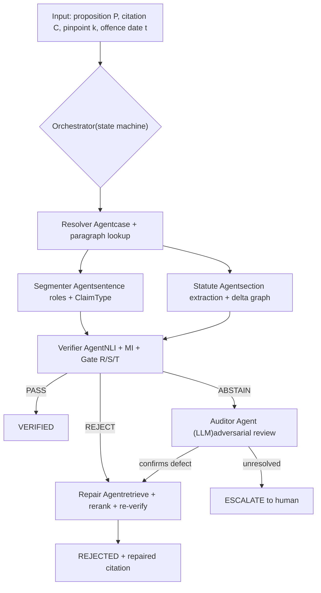
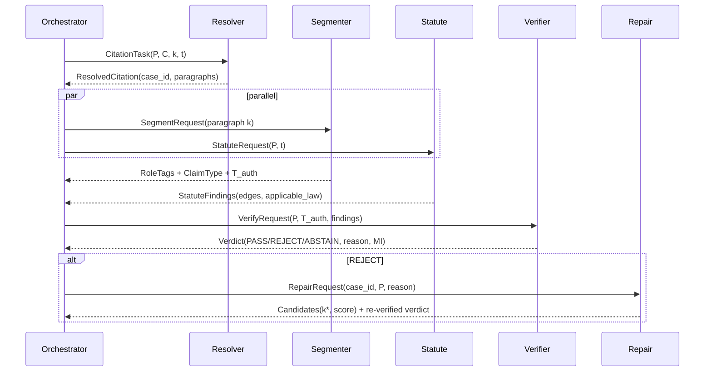
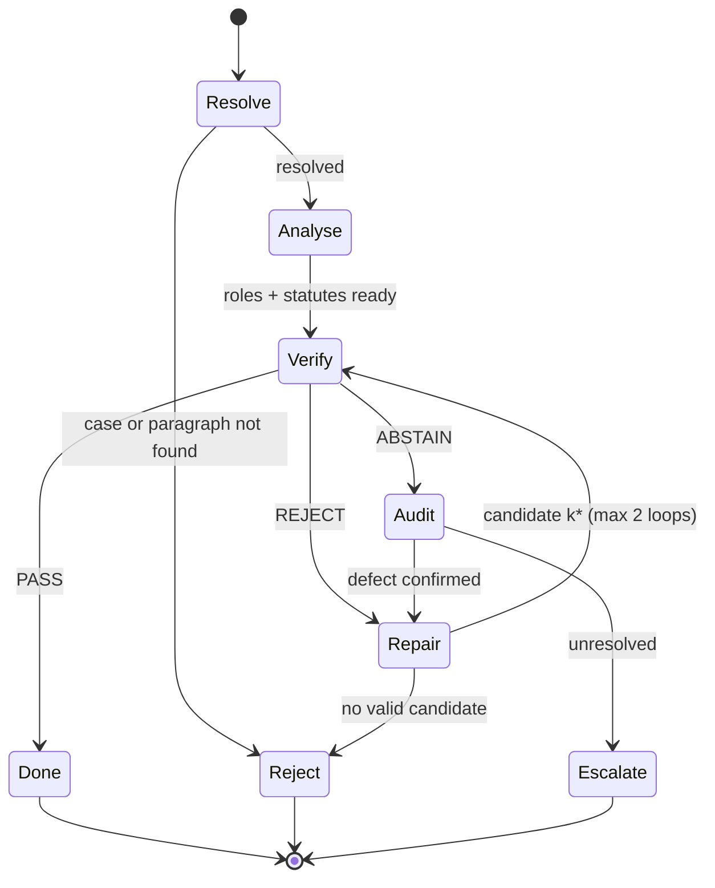

# RhetoriCite-India: Multi-Agent Architecture & Implementation Guide

Companion to the v2 plan. Adds the multi-agent design, diagrams, and a build guide.

**Design rule:** an agent exists only if it has its own tools, state, and failure mode. Final PASS/REJECT decisions stay deterministic (gates over calibrated model scores); LLM agents may propose, explain, and audit but never override a gate. Because reviewers will ask "is this just a pipeline?", the paper must include the single-agent and fixed-pipeline ablations in section 6.

## 1. System architecture



## 2. Message flow



## 3. Orchestrator state machine



## 4. Agent specifications

| Agent | Kind | Tools | Output |
| --- | --- | --- | --- |
| Orchestrator | Deterministic graph (no LLM routing) | State store, trace logger | Final verdict + trace |
| Resolver | Rules + LLM fallback for odd formats | Citation regex (SCC/AIR/INSC), judgment index | `ResolvedCitation` |
| Segmenter | Fine-tuned models (no LLM) | Role tagger, ClaimType classifier | Roles, `T_auth`, claim type |
| Statute | Deterministic graph + NER | Section NER, multi-label delta graph, savings rules | `StatuteFindings` |
| Verifier | Calibrated ensemble + symbolic gates | NLI cross-encoder (5 members), threshold config | PASS / REJECT(reason) / ABSTAIN, MI |
| Repair | Retrieval + reranker; LLM only drafts explanation | BM25, bi-encoder, cross-encoder, Verifier (re-call) | Ranked `k*` candidates |
| Auditor | LLM (adversarial prompt) | Read-only access to T_auth and paragraph | Defect confirmed / unresolved + rationale |

## 5. Implementation guide

### 5.1 Repo layout

```
rhetoricite/
  agents/        resolver.py segmenter.py statute.py verifier.py repair.py auditor.py
  graph.py       # orchestrator (LangGraph StateGraph)
  schemas.py     # pydantic messages
  models/        tagger/ claimtype/ nli/ (training scripts + configs)
  data/          corpus/ citations/ statute_graph/ benchmark/
  eval/          run_baselines.py run_ablations.py stats.py
  configs/       thresholds.yaml (tuned on dev only)
  traces/        one JSON per item: agent calls, tokens, latency
tests/           per-agent unit tests + golden items
```

### 5.2 Message schemas (build these first)

```
class CitationTask(BaseModel):
    prop: str; cite: str; pinpoint: str; offence_date: date

class Verdict(BaseModel):
    label: Literal["PASS","REJECT","ABSTAIN"]
    reason: Optional[Literal["RHETORICAL_MISMATCH","LOW_ENTAILMENT",
                             "TEMPORAL_DRIFT","NOT_FOUND"]]
    p_support: float; mutual_info: float
```

### 5.3 Orchestrator skeleton (sketch; check current LangGraph API)

```
from langgraph.graph import StateGraph, END
g = StateGraph(State)
for n, f in [("resolve",resolve),("analyse",analyse),("verify",verify),
             ("audit",audit),("repair",repair)]:
    g.add_node(n, f)
g.set_entry_point("resolve")
g.add_conditional_edges("resolve", lambda s: "analyse" if s.resolved else END)
g.add_edge("analyse", "verify")   # analyse runs Segmenter + Statute in parallel
g.add_conditional_edges("verify", lambda s: {"PASS":END,
    "REJECT":"repair","ABSTAIN":"audit"}[s.verdict.label])
g.add_conditional_edges("audit", lambda s: "repair" if s.defect else END)
g.add_conditional_edges("repair", lambda s: "verify" if s.loops < 2 else END)
app = g.compile()
```

### 5.3b Build order

| Step | Build | Done when |
| --- | --- | --- |
| 1 | Schemas, trace logger, config loader | Every agent call logs tokens + latency |
| 2 | Resolver on 200 hand-checked citations | ≥95% case, ≥90% paragraph accuracy |
| 3 | Segmenter (tagger + ClaimType) as standalone | Paragraph-level macro-F1 reported on dev |
| 4 | Statute Agent with expert-labelled edges | κ ≥ 0.7; savings-rule unit tests pass |
| 5 | Verifier: train NLI, calibrate, set gates on dev | ECE reported; thresholds frozen |
| 6 | Wire orchestrator; run single-pass (no repair/audit) | Reproduces non-agentic baseline |
| 7 | Add Repair, then Auditor | Each added only if it passes its ablation |
| 8 | Freeze everything; run test split once | Traces archived for the paper |

### 5.4 Rules that keep it honest

- Agents communicate only through typed messages, so each can be unit-tested and ablated.
- Cap repair loops at 2; log every loop.
- Auditor sees only text and gate outputs, not gold labels; cannot flip a REJECT to PASS.
- Thresholds live in `thresholds.yaml`, tuned on dev, frozen before the test run.
- Pin model versions and seeds; save prompts with the traces.

## 6. Evidence that "multi-agent" is justified

| System | Description | Question |
| --- | --- | --- |
| M1 | Single LLM agent given all tools | Does agent specialisation beat one tool-using LLM? |
| M2 | Fixed pipeline, no Auditor, no loops | Does the orchestration add anything? |
| M3 | Full multi-agent (this design) | Gain vs M1, M2 |
| M4 | M3 without Auditor | Does LLM audit reduce errors on ABSTAIN items? |
| M5 | M3 with oracle roles | Upper bound from tagger quality |

Report per tier: recall, FPR, F1, abstention rate, average tool calls, tokens, latency. If M3 does not beat M2 meaningfully, describe the system as a calibrated pipeline with a repair module and drop the "multi-agent" claim.